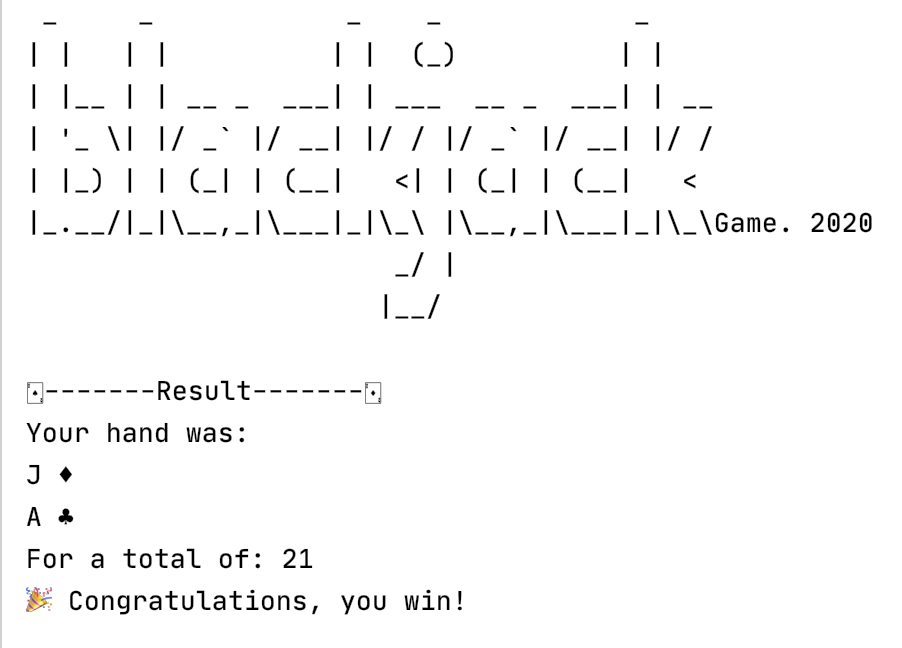

# Android Summer Bootcamp 2020 🚀

* **Name**: Janin Culhaoglu
* **Discord Username**: janin#7234
* **Location**: Paris, France

## My programming experience
I started to learn programming at the beginning of 2019. Before that I was mainly working as a video editor.

To learn iOS development, I have combined one year with **OpenClassrooms online course** and one year at the ** Apple Developer Academy of Naples.**
I graduated in february 2020 in app development with Openclassroms, and for the Apple Developer Academy, I will graduate at the end of june 2020 👩🏻‍🎓.

During this lockdown, I created my first app on the App Store: **CookMe**. [Here is the link!](https://apps.apple.com/sz/app/cookme/id1508888799)

Swift was my first programming language and I love it, I love coding! 👩🏻‍💻

## What's next?
My next step is to learn Android development with the **Raywenderlich Android bootcamp** of 3 months!
And I hope to get a job as an iOS/Android Developer in September 2020!

&nbsp;
&nbsp;
## Bootcamp challenges

**Week 1**: Deal and Evaluate an Initial Hand of Blackjack

Create a program that creates a deck of cards, deals two cards from that deck into a hand and evaluates that hand of cards by finding the sum of the pips. 
Display the cards in the hand and the total of the pips in the hand. 
Utilize classes, collections and functions.

|  | 
|:--:| 
| *Preview of Week 1 challenge* |
